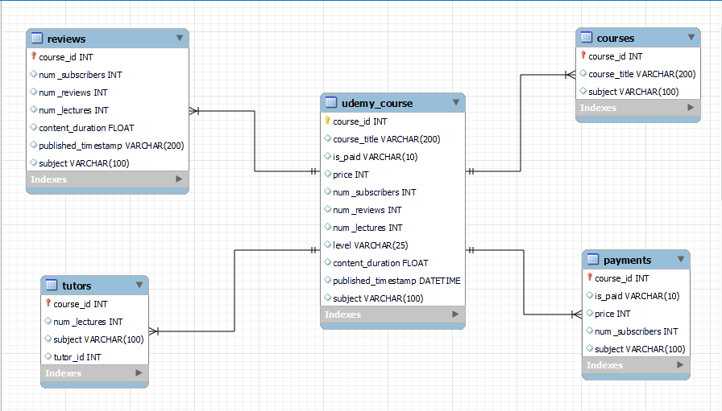

# Udemy-Platform-Analysis

## Introduction
In this project, I built a database for an e-learning platform offering 3600 courses in 4 subject areas, 4 tutors between January, 2011- September, 2017 and analysed enrollment, instructors, payment and student behaviour

## Tools & Skills
 - MySql
 - ERD
 - View
 - Stored Procedure
 - Window functions
 - Subqueries
 - CTEs
 - Join: Inner join, Left join, Right join

## Method
1. Create Database, Table and imported the CSV file through table import wizard

2. Data Cleaning: removed duplicates, removed the text in timestamp and UPDATE the column to datetime from text

3. Data Analysis

4. Created Views

### This analysis answered questions such as:
1. Which courses generate the most engagement.
2. What's the Monthly and Yearly  Revenue Trend
3. Top Performing Instructors (by enrollments, ratings, revenue)
4. What is the total and average number of subscribers to each course
5. What is the performance of Paid and Unpaid Course 
